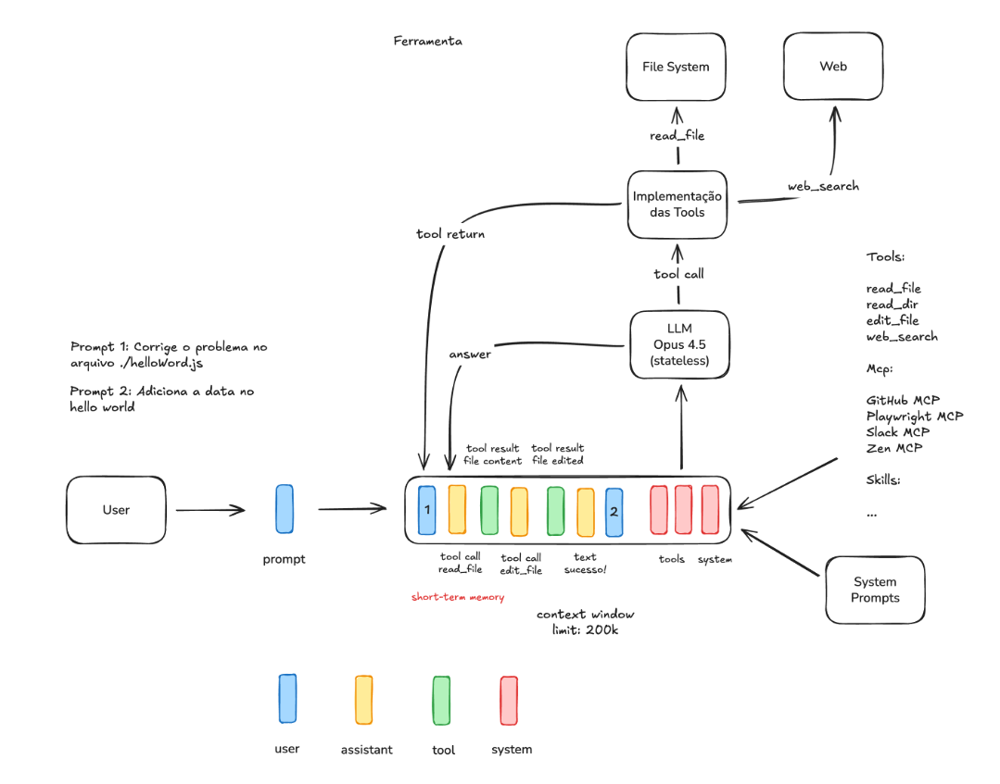

# Engenharia de Contexto - Parte 1 (short-term memory)

Toda vez que você digita uma mensagem no Claude Code, o que vai para o servidor não é só o que você escreveu. É um **array JSON com o histórico completo da conversa** — cada mensagem, cada resposta, cada resultado de ferramenta.

Isso é a **janela de contexto**, e ela é o coração de um conceito chamado **Engenharia de Contexto** — que nas palavras de Tobi Lutke (CEO da Shopify) é _"a arte de fornecer todo o contexto necessário para que a tarefa seja solucionada pela LLM"_ ([tweet original](https://x.com/tobi/status/1935533422589399127)). Diferente do prompt engineering, que se preocupa com "como escrever um bom prompt", context engineering vai além: trata do que está nesse array no momento em que a LLM processa sua mensagem.

Entender isso muda a forma como você usa qualquer ferramenta de IA. É isso que esse post explica.

O projeto acompanha o conteúdo com exemplos práticos, baseados no curso de IA para devs do Rodrigo Branas (https://www.branas.io/formacoes/inteligencia-artificial). O código completo está em [github.com/renangabriel27/context-engineering-ia](https://github.com/renangabriel27/context-engineering-ia/tree/main/context-window). Para rodar, configure o `.env`:

```bash
cp .env.example .env
```

```
OPENROUTER_API_KEY=sua_chave_aqui
OPENROUTER_MODEL=x-ai/grok-4.1-fast
```

## O que é a Janela de Contexto

Toda vez que você envia uma mensagem para uma ferramenta de IA, o que vai para o servidor não é só a sua última mensagem. É um **array JSON com o histórico completo da conversa** cada mensagem, cada resposta, cada resultado de ferramenta.

Isso é a **janela de contexto** (context window). É a única "memória" que a LLM tem durante uma sessão.

**LLM** (Large Language Model) é o modelo de linguagem que processa o texto e gera as respostas o Claude Sonnet, GPT-4o e Grok são exemplos. Toda ferramenta de IA como Claude Code, Cursor ou Copilot usa uma LLM por baixo dos panos.

A estrutura é simples:

```json
{
  "messages": [
    { "role": "system",    "content": "Você é um assistente de código..." },
    { "role": "user",      "content": "o arquivo helloWorld.js não está funcionando" },
    { "role": "assistant", "content": "Vou verificar o arquivo..." }
  ]
}
```

Cada mensagem tem uma `role` que indica quem está falando:

- **`system`**: instruções base da ferramenta, com o maior peso na resposta
- **`user`**: você
- **`assistant`**: a LLM

A cada turno da conversa o array cresce, e esse array inteiro vai para o servidor a cada requisição. A LLM não tem estado entre sessões. Ela lê o array do zero toda vez e gera a próxima mensagem com base nisso.

## O System Prompt

O `system` prompt é o que define o comportamento da LLM. É por isso que o Claude Code responde de forma diferente do Copilot, mesmo que ambos usem modelos similares por baixo.

No projeto desse post, o system prompt está no arquivo `SYSTEM.md`:

```md
Você é um assistente de IA especializado em desenvolvimento e correção de código.

## Diretrizes

- Analise o código fornecido de forma crítica e identifique problemas, bugs ou melhorias
- Sugira correções claras e objetivas, explicando o motivo de cada alteração
- Siga as boas práticas de programação e padrões de código limpo
- Responda sempre em português brasileiro
- Não liste ou acesse diretórios fora do projeto atual
- Foque apenas nos arquivos mencionados pelo usuário
```

O Claude Code tem um system prompt muito mais extenso. Depois que o código-fonte dele vazou, teve até [discussão sobre isso no Reddit](https://www.reddit.com/r/ClaudeCode/comments/1rshmq8/claude_code_isnt_stupid_now_its_being_system/). Um trecho do que foi revelado:

```
## Concisão
- Vá direto ao ponto. Abordagem mais simples primeiro, sem rodeios.
- Comece com a resposta ou ação, não com o raciocínio.
- Se cabe em uma frase, não use três.

## Execução de Tarefas
- Não proponha mudanças em código que não leu.
- Não crie arquivos a menos que seja absolutamente necessário.
- Cuidado com vulnerabilidades (OWASP top 10: injeção, XSS, etc.).
```

Isso explica comportamentos que a maioria dos devs acha estranho no Claude Code mas que fazem total sentido quando você vê as instruções.

## Experimento 1: sem ferramentas

O arquivo `helloWorld.js` tem um bug proposital:

```javascript
const msg = "Hello World";
console.log(message); // variável errada, deveria ser msg
```

Rodando o `assistant-without-tools.ts`, que envia apenas o system prompt e o prompt do usuário sem nenhuma ferramenta adicional:

```bash
npx ts-node assistant-without-tools.ts "o arquivo helloWorld nao esta funcionando, faca uma correcao"
```

A resposta foi:

```
Por favor, forneça o conteúdo do arquivo `helloWorld` (incluindo a linguagem de
programação e o código completo) para que eu possa analisar os problemas e
sugerir correções específicas. Sem o código, não é possível identificar o erro.
```

A LLM não tem como ler o arquivo. Ela só trabalha com o que está na janela de contexto, e nesse caso havia apenas o system prompt e o pedido do usuário. Sem o código no array, ela não pode agir.

O `context.log` gerado confirma: a conversa terminou com 3 mensagens.

```json
{
  "messages": [
    { "role": "system",    "content": "Você é um assistente de código..." },
    { "role": "user",      "content": "o arquivo helloWorld nao esta funcionando, faca uma correcao" },
    { "role": "assistant", "content": "Por favor, forneça o conteúdo do arquivo..." }
  ]
}
```

## Tools: como a LLM age no mundo real

**Tools** (ferramentas) são funções que rodam na sua máquina, não na nuvem. A LLM não executa código diretamente, ela solicita que uma tool execute e recebe o resultado de volta dentro da janela de contexto.

Um ponto importante: a LLM não vê o código da tool. Ela só conhece o **nome** e a **descrição** de cada uma. É o mesmo princípio dos MCPs: você registra a ferramenta descrevendo o que ela faz, e o modelo decide quando e como chamá-la.

O projeto tem cinco tools:

| Tool | O que faz |
|------|-----------|
| `listDirectory` | Lista os arquivos de uma pasta |
| `readFile` | Lê o conteúdo de um arquivo |
| `createFile` | Cria um arquivo novo |
| `editFile` | Edita um arquivo existente substituindo um trecho |
| `bash` | Executa um comando bash e retorna o output |

Cada ferramenta de IA tem seu próprio conjunto de tools. No Claude Code, por exemplo, você pode pedir `Liste suas tools disponíveis` e ele responde com algo assim:

```
Arquivo e código
  - Edit — edita arquivos com substituição exata de string
  - Write — cria ou reescreve arquivos
  - Bash — executa comandos shell

Agentes e tarefas
  - Agent — lança sub-agentes especializados (Explore, Plan, code-reviewer, etc.)
  - TaskCreate / TaskGet / TaskList / TaskUpdate / TaskStop / TaskOutput — gerencia tarefas dentro da conversa

Busca e navegação
  - WebFetch — busca conteúdo de uma URL
  - WebSearch — pesquisa na web

IDE e código
  - LSP — diagnósticos e navegação via Language Server Protocol
  - mcp__ide__getDiagnostics — erros/warnings do IDE

[...]
```

Você pode pedir o mesmo para o Cursor, Copilot, Codex, cada um terá seu próprio conjunto.

## Experimento 2: com ferramentas

O `assistant-with-tools.ts` é idêntico ao `assistant-without-tools.ts`, com a única diferença de incluir as tools na requisição. Rodando:

```bash
npx ts-node assistant-with-tools.ts "o arquivo helloWorld nao esta funcionando, faca uma correcao"
```

Resultado:

```
[TOOL] listDirectory(path=".")
[TOOL] readFile(path="helloWorld.js")
[TOOL] editFile(path="helloWorld.js", old="console.log(message);", new="console.log(msg);")
[TOOL] bash(command="node helloWorld.js")

### Análise do arquivo `helloWorld.js`
Problema: `console.log(message)`, variável declarada é `msg`.
Correção: alterado para `console.log(msg)`.
Teste: node helloWorld.js retornou "Hello World" sem erros.
```

Foram necessárias 4 iterações. O `context.log` mostra como o array cresceu a cada passo:

```json
{
  "messages": [
    { "role": "system",    "content": "Você é um assistente de código..." },
    { "role": "user",      "content": "o arquivo helloWorld nao esta funcionando, faca uma correcao" },

    { "role": "assistant", "content": [{ "type": "tool-call", "toolName": "listDirectory", "input": { "path": "." } }] },
    { "role": "tool",      "content": [{ "type": "tool-result", "output": "helloWorld.js\nassistant-without-tools.ts\n..." }] },

    { "role": "assistant", "content": [{ "type": "tool-call", "toolName": "readFile", "input": { "path": "helloWorld.js" } }] },
    { "role": "tool",      "content": [{ "type": "tool-result", "output": "const msg = \"Hello World\";\nconsole.log(message);\n" }] },

    { "role": "assistant", "content": [{ "type": "tool-call", "toolName": "editFile", "input": { "oldContent": "console.log(message);", "newContent": "console.log(msg);" } }] },
    { "role": "tool",      "content": [{ "type": "tool-result", "output": "File edited: helloWorld.js" }] },

    { "role": "assistant", "content": [{ "type": "tool-call", "toolName": "bash", "input": { "command": "node helloWorld.js" } }] },
    { "role": "tool",      "content": [{ "type": "tool-result", "output": "Hello World" }] },

    { "role": "assistant", "content": "### Análise do arquivo `helloWorld.js`..." }
  ]
}
```

Cada chamada de tool vira uma mensagem `assistant` com um `tool-call`, e o resultado volta como role `tool`. A LLM lê tudo isso e decide o próximo passo com base no estado atual do array. Não tem nada mágico acontecendo, é o array crescendo e sendo relido a cada iteração.

## Contexto tem custo: passe só o que importa

Rodando o mesmo comando com o caminho do arquivo especificado:

```bash
npx ts-node assistant-with-tools.ts "o arquivo ./helloWorld.js nao esta funcionando, faca uma correcao"
```

Resultado:

```
[TOOL] readFile(path="./helloWorld.js")
[TOOL] editFile(path="./helloWorld.js", ...)
```

Três steps em vez de quatro. A LLM foi direto ao `readFile` porque o caminho já estava no prompt. O `listDirectory` foi eliminado.

Isso ilustra o princípio central da Engenharia de Contexto. Cada **token** (a unidade que a LLM usa para processar texto) tem custo e peso. Mais tokens na janela de contexto significa requisições mais caras, respostas mais lentas, e maior probabilidade de alucinação (quando a LLM gera informações incorretas ou inventadas).

Quando você usa `@arquivo` no Claude Code ou especifica o caminho exato no Cursor, você está reduzindo o trabalho de exploração da ferramenta e entregando um contexto mais preciso. O resultado é melhor porque a LLM tem menos ruído para processar.

A regra é direta: `@src/services/payment.ts` é melhor que `@src`. `@src` é melhor que nenhuma referência. Quanto mais específico o contexto, melhor a resposta.

## A janela de contexto em perspectiva



A imagem acima mostra a arquitetura completa. A barra horizontal central representa a janela de contexto com o limite de 200k tokens do Claude Opus 4.5. Dentro dela, cada tipo de mensagem ocupa espaço: system, user, assistant e tool.

À direita estão as tools executando na máquina local (read_file, edit_file, web_search) e os MCPs disponíveis (GitHub, Playwright, Slack). À esquerda, os prompts do usuário entrando. No centro, a LLM, que é **stateless** (sem estado próprio), lendo o array completo e gerando a próxima mensagem.

Tudo que a LLM "conhece" em um dado momento é o que está dentro dessa barra. Quando o limite é atingido, as mensagens mais antigas começam a ser descartadas. O comportamento que parece "esquecimento" em sessões longas é exatamente isso: a janela de contexto se esgotando.

## Gerenciando a janela de contexto no Claude Code

No dia a dia com o Claude Code, o array cresce rápido: arquivos lidos, comandos executados, resultados de tools. Três comandos ajudam a gerenciar isso diretamente:

**`/context`** mostra o estado atual da janela de contexto — quantos tokens estão ocupados e qual é o limite. É o equivalente a olhar para o array e ver quanto espaço ainda resta antes de as mensagens mais antigas começarem a ser descartadas.

**`/compact`** comprime o histórico resumindo as mensagens mais antigas. O array não é descartado — ele é condensado: a LLM recebe um resumo do que aconteceu antes em vez de cada mensagem na íntegra. Útil quando você está no meio de uma tarefa longa e não quer perder o fio da conversa.

**`/clear`** limpa o array por completo. A próxima mensagem começa do zero, só com o system prompt. Útil quando você terminou uma tarefa e vai começar outra sem relação com a anterior — carregar contexto irrelevante só adiciona ruído e aumenta o risco de alucinação.

A escolha entre os dois depende do momento: `/compact` quando quer continuar de onde parou com menos peso, `/clear` quando quer um começo limpo.

Para mais detalhes sobre como o Claude Code gerencia contexto, o curso oficial da Anthropic tem uma aula dedicada ao tema: [Claude Code 101](https://anthropic.skilljar.com/claude-code-101/469793).

## Conclusão

A janela de contexto é um array de mensagens que cresce a cada turno, enviado integralmente ao servidor a cada requisição. A LLM não tem estado: ela lê esse array do zero toda vez e gera a próxima mensagem.

O que define a qualidade de uma ferramenta de desenvolvimento com IA são três coisas:

1. O **system prompt**, que instrui como a LLM deve se comportar
2. As **tools**, que permitem que ela leia arquivos, execute código e interaja com o ambiente
3. O **contexto que você fornece**, que é o único material disponível para ela trabalhar

A qualidade do resultado está diretamente ligada à qualidade do contexto. Uma LLM com um bom system prompt, ferramentas bem definidas e um contexto preciso resolve problemas que a mesma LLM com contexto vago não consegue.

Nos próximos posts: rules, skills e MCPs e como organizar projetos para trabalhar bem com essas ferramentas.

_Post baseado em uma das primeiras aulas do curso de IA para devs do Rodrigo Branas: https://www.branas.io/formacoes/inteligencia-artificial_
